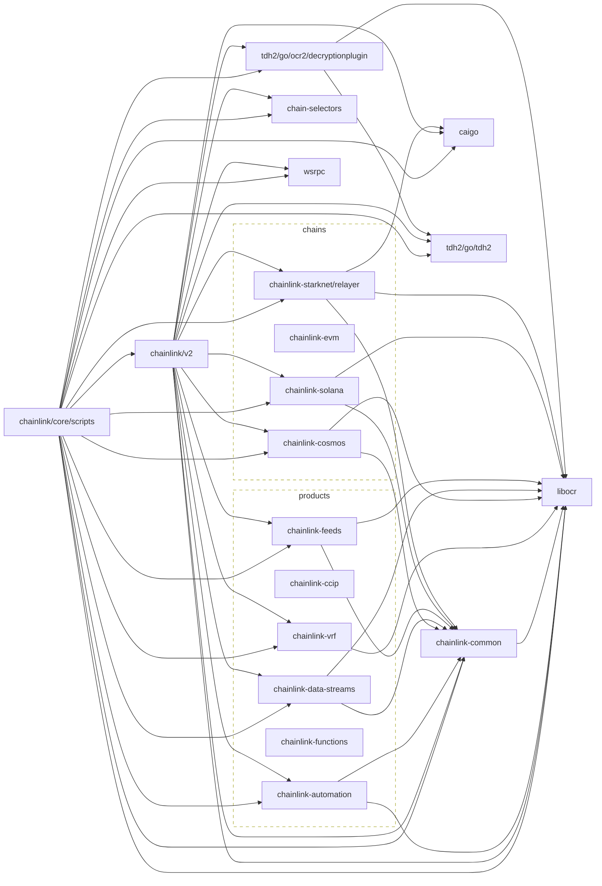

# smartcontractkit Go modules

```mermaid
flowchart LR
  subgraph chains
    chainlink-cosmos
    chainlink-evm
    chainlink-solana
    chainlink-starknet/relayer
  end

  subgraph products
    chainlink-automation
    chainlink-ccip
    chainlink-data-streams
    chainlink-feeds
    chainlink-functions
    chainlink-vrf
  end

  classDef outline stroke-dasharray:6,fill:none;
  class chains,products outline

  chainlink/core/scripts --> chain-selectors
  click chain-selectors href "https://github.com/smartcontractkit/chain-selectors"
  chainlink/core/scripts --> chainlink-automation
  click chainlink-automation href "https://github.com/smartcontractkit/chainlink-automation"
  chainlink/core/scripts --> chainlink-common
  click chainlink-common href "https://github.com/smartcontractkit/chainlink-common"
  chainlink/core/scripts --> chainlink-vrf
  click chainlink-vrf href "https://github.com/smartcontractkit/chainlink-vrf"
  chainlink/core/scripts --> chainlink/v2
  click chainlink/v2 href "https://github.com/smartcontractkit/chainlink"
  chainlink/core/scripts --> libocr
  click libocr href "https://github.com/smartcontractkit/libocr"
  chainlink/core/scripts --> caigo
  click caigo href "https://github.com/smartcontractkit/caigo"
  chainlink/core/scripts --> chainlink-cosmos
  click chainlink-cosmos href "https://github.com/smartcontractkit/chainlink-cosmos"
  chainlink/core/scripts --> chainlink-data-streams
  click chainlink-data-streams href "https://github.com/smartcontractkit/chainlink-data-streams"
  chainlink/core/scripts --> chainlink-feeds
  click chainlink-feeds href "https://github.com/smartcontractkit/chainlink-feeds"
  chainlink/core/scripts --> chainlink-solana
  click chainlink-solana href "https://github.com/smartcontractkit/chainlink-solana"
  chainlink/core/scripts --> chainlink-starknet/relayer
  click chainlink-starknet/relayer href "https://github.com/smartcontractkit/chainlink-starknet"
  chainlink/core/scripts --> tdh2/go/ocr2/decryptionplugin
  click tdh2/go/ocr2/decryptionplugin href "https://github.com/smartcontractkit/tdh2"
  chainlink/core/scripts --> tdh2/go/tdh2
  click tdh2/go/tdh2 href "https://github.com/smartcontractkit/tdh2"
  chainlink/core/scripts --> wsrpc
  click wsrpc href "https://github.com/smartcontractkit/wsrpc"
  chainlink/v2 --> caigo
  chainlink/v2 --> chain-selectors
  chainlink/v2 --> chainlink-automation
  chainlink/v2 --> chainlink-common
  chainlink/v2 --> chainlink-cosmos
  chainlink/v2 --> chainlink-data-streams
  chainlink/v2 --> chainlink-feeds
  chainlink/v2 --> chainlink-solana
  chainlink/v2 --> chainlink-starknet/relayer
  chainlink/v2 --> chainlink-vrf
  chainlink/v2 --> libocr
  chainlink/v2 --> tdh2/go/ocr2/decryptionplugin
  chainlink/v2 --> tdh2/go/tdh2
  chainlink/v2 --> wsrpc
  chainlink-automation --> chainlink-common
  chainlink-automation --> libocr
  chainlink-common --> libocr
  chainlink-vrf --> libocr
  chainlink-cosmos --> chainlink-common
  chainlink-cosmos --> libocr
  chainlink-data-streams --> chainlink-common
  chainlink-data-streams --> libocr
  chainlink-feeds --> chainlink-common
  chainlink-feeds --> libocr
  chainlink-solana --> chainlink-common
  chainlink-solana --> libocr
  chainlink-starknet/relayer --> caigo
  chainlink-starknet/relayer --> chainlink-common
  chainlink-starknet/relayer --> libocr
  tdh2/go/ocr2/decryptionplugin --> libocr
  tdh2/go/ocr2/decryptionplugin --> tdh2/go/tdh2
```
